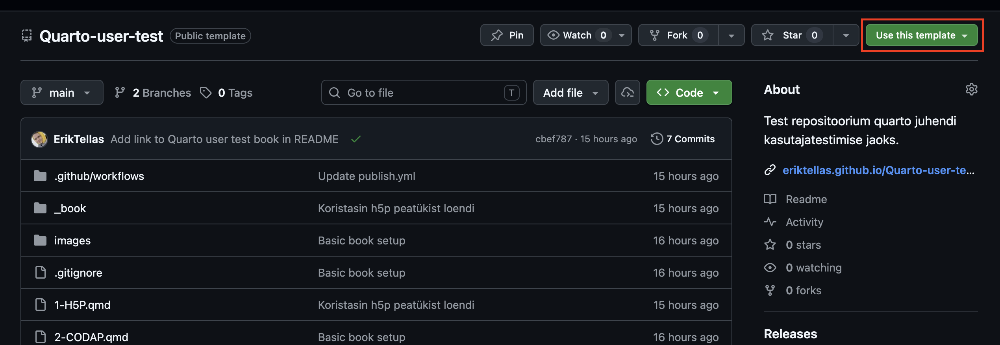
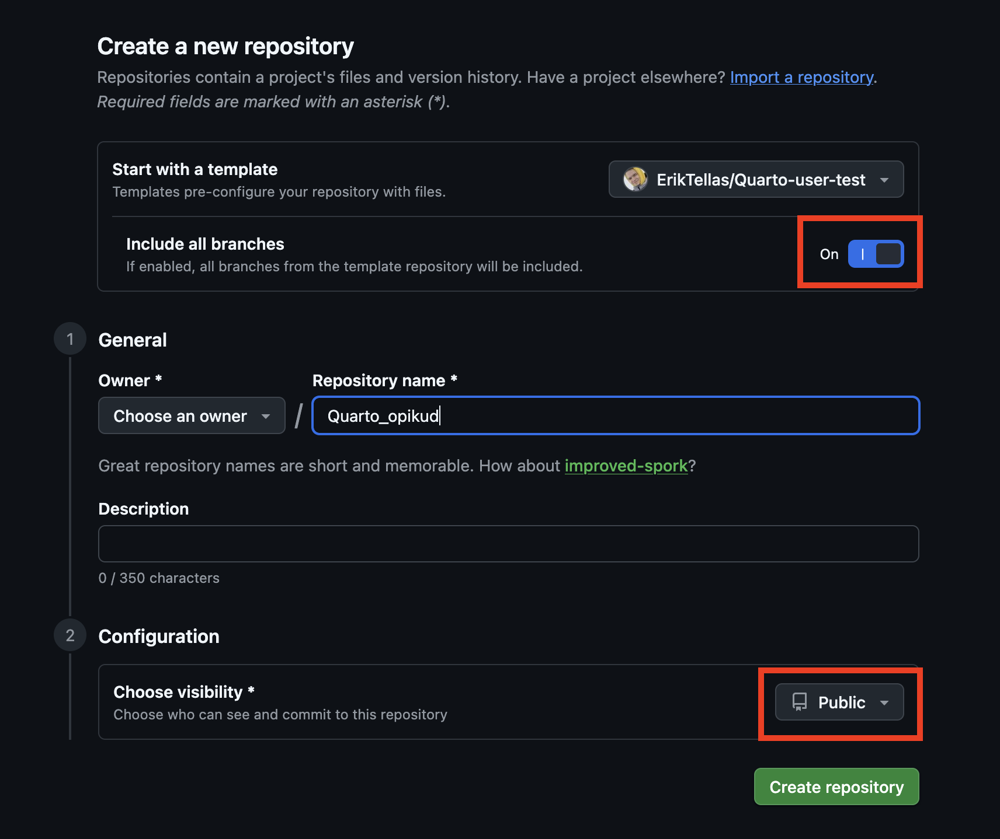
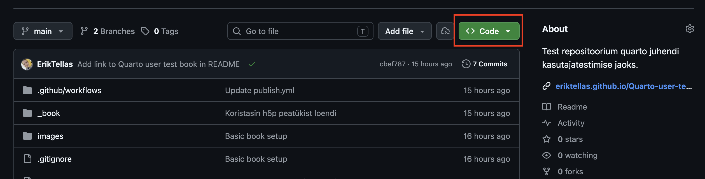
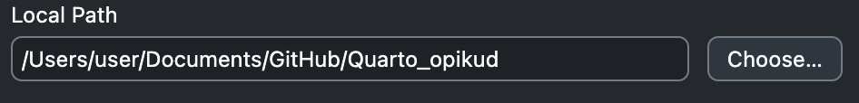
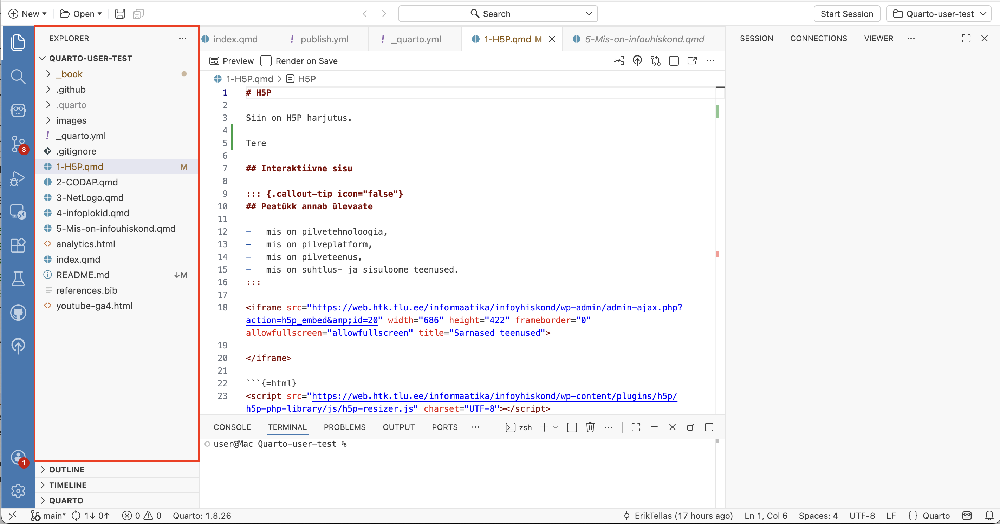
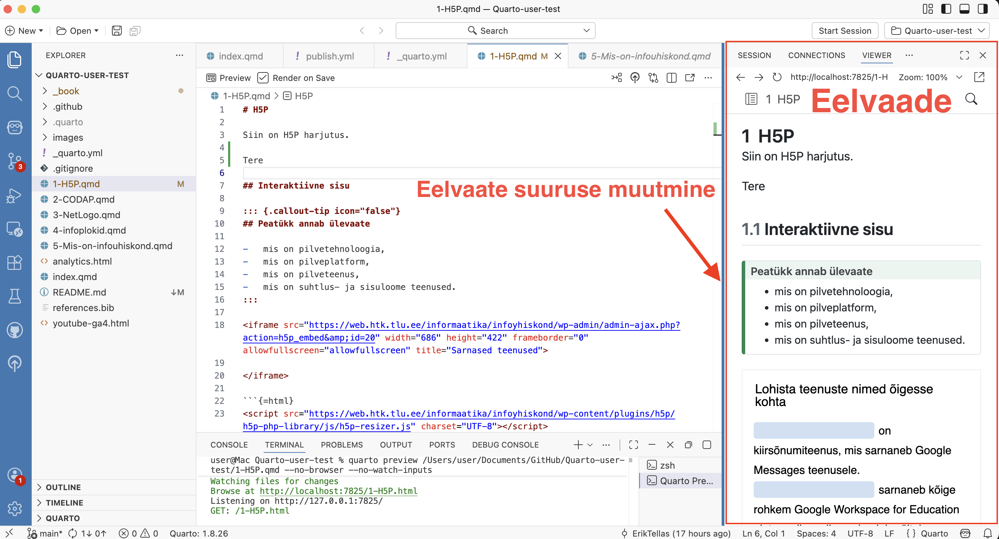

# Kuidas alustada

Selles peatükis on juhised, kuidas paigaldada oma arvutisse vajalikud tööriistad Quarto raamatu loomiseks ja muutmiseks. Seejärel juhised, kuidas kloonida see raamatu repositoorium oma arvutisse ja avada see Positronis, et saaksid raamatut vaadata ja muuta.

## Positron installimine

**Positron** on IDE (Integrated Development Environment - Arenduskeskkond), mis sisaldab vajalike tööriistu Quarto raamatute loomiseks ja sisu muutmiseks.

1.  Mine aadressile: <https://positron.posit.co/install.html>
2.  Lae alla installer oma operatsioonisüsteemile (Windows, macOS, Linux)
3.  Käivita installer ja järgi juhiseid

## GitHub Desktop installimine

**GitHub** on veebipõhine platvorm koodi ja dokumentatsiooni majutamiseks ning versioonihalduseks. **GitHub Desktop** on tööriist, mis võimaldab sul hallata GitHubi repositooriume oma arvutis.

1.  Mine aadressile: <https://desktop.github.com/>
2.  Lae alla installer ja käivita see
3.  Logi sisse oma GitHub kontoga (kui sul pole kontot, loo see aadressil <https://github.com>)

## Repositooriumi loomine malli kaudu

Järgmise sammuna loo omale repositoorium kasutades selleks malli, mis sisaldab lihtsat Quarto raamatut.

::: callout-important
## Oluline on tuua üle kõik harud(*branches*) ja repositoorium peab olema avalik!
:::

1.  Mine brauseris aadressile: <https://github.com/tluhk/Quarto-mall>

2.  Klõpsa rohelist **"Use this template"** nuppu ja seejärel **"Create a new repository"**

    

3.  Vali **"Include all branches"**.

    

4.  Anna repositooriumile nimi `Quarto_opikud` ja määra repositoorium avalikuks

5.  Seejärel vajuta nuppu **"Create Repository"**

## Repositooriumi kloonimine

Nüüd oled loonud omale malli järgi lihtsa Quarto raamatu repositooriumi. Järgmise sammuna klooni see oma arvutisse.

1.  Ava brauseris oma repositoorium (või kui juba oled seal siis jätta see samm vahele): https://github.com/SINU_KASUTAJANIMI/Quarto_opikud

2.  Klõpsa rohelist **"Code"** nuppu

    

3.  Vali **"Open with GitHub Desktop"**

4.  GitHub Desktop avaneb ja küsib, kuhu soovid projekti salvestada. Soovituslik on valida vaikimisi kaust `Documents/GitHub/Quarto_opikud`

    

5.  Klõpsa **"Clone"**

## Projekti avamine Positronis

1.  Ava rakendus **Positron**

    ::: callout-note
    ## Positron võib sind hoiatada, et git pole paigaldatud. Võid seda hetkel ignoreerida.
    :::

2.  Vali **File → Open Folder**

3.  Navigeeri kausta `Quarto_opikud`. Vaikimisi paigutasid sa selle oma dokumentide kastas asuvasse `Github`kausta. (`Documents/GitHub/Quarto_opikud`)

4.  Klõpsa **Open / Select Folder**

5.  Positron küsib, kas usaldad selle kausta failide autoreid, klõpsa `Yes, I trust the authors`

Nüüd oled avanud raamatu projekti kausta Positroni rakenduses. Vasakul pool asub `Explorer` paneel. Siin näed sa erinevaid faile mis asuvad selles kaustas. Iga `.qmd` fail on eraldi peatükk. Näiteks `5-Mis-on-infoühiskond.qmd` on selles näidisraamatus peatükk "Mis on info ühiskond?".

{fig-align="left"}

::: callout-tip
## Täpsemalt saad soovikorral tutvuda ühe tüüpilise raamatu struktuuriga peatükis 2.
:::

## Raamatu eelvaade

Eelvaade võimaldab sul näha milline näeb su raamatu välja veebis.

1.  Ava mõni `.qmd` fail (nt `5-Mis-on-infoühiskond.qmd`), avades vasakul pool `explorer` paneelis kausta `Quarto_opikud` ja klõpsates faili nimel

2.  Üleval vasakul on valik **Render on Save**, veendu, et see on valitud. See tähendab, et Quarto üritab tuvastada automaatselt, kui sa salvestad faili ja uuendab eelvaadet.

3.  Klõpsa üleval nuppu **Preview** (või vajuta `Ctrl+Shift+K` / `Cmd+Shift+K`)

    

4.  Paari sekundi jooksul avaneb raamatu eelvaade Positroni sisseehitatud brauseris. Eelvaadet paneeli saad kursuriga tõmmata suuremaks ja väiksemaks. Kui asetad kursori eelvaate paneeli servale muutub serv siniseks.

{fig-align="left"}

------------------------------------------------------------------------