# Kuidas sisu muuta

Selles peatükis on juhised, kuidas olemasoleva raamatu sisu muuta ja kuidas lisada uusi peatükke. Lisaks lühike ülevaade Markdowni põhitõdedest, mida kasutatakse `.qmd` failides.

## Olemasoleva peatüki muutmine, visuaalne redaktor

### Visuaalse redaktori määramine vaikimisi redaktoriks

Positronis saab Quarto raamatute sisu muuta kahes eri "režiimis". Nendeks on **Source mode** ja **Visual mode**.

Selle juhendi raames määrame visuaalse redaktori oma vaikimisi redaktoriks.

1.  Vali mõni `.qmd` fail Explorer paneelist ja kliki selle peal parema klahviga. Seejärel vali **Open with**

    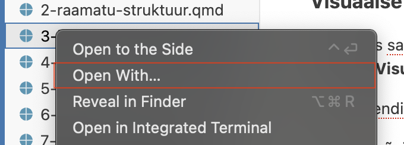{width="500"}

2.  Avanenud aknas vali kõige alt **Configure default editor**

    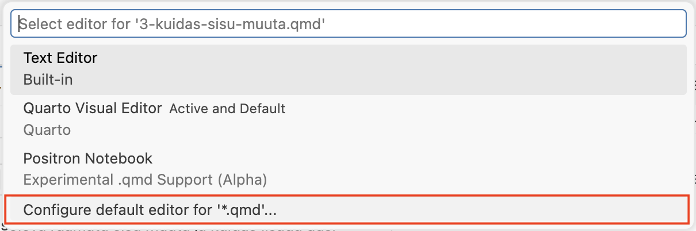{width="500"}

3.  Vali **Quarto Visual Editor**

    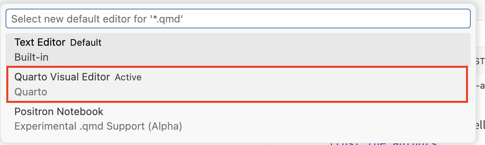{width="500"}

    Avaneb visuaalne redaktor, kus saad toimetada hetkel valitud peatüki faili. Edaspidi avatavad failid avanevad samuti visuaalses redaktoris.

    Visuaalses redaktoris saad lisada ja kustutada teksti, lisada pilte, tabeleid, koodiplokke ja palju muud.

    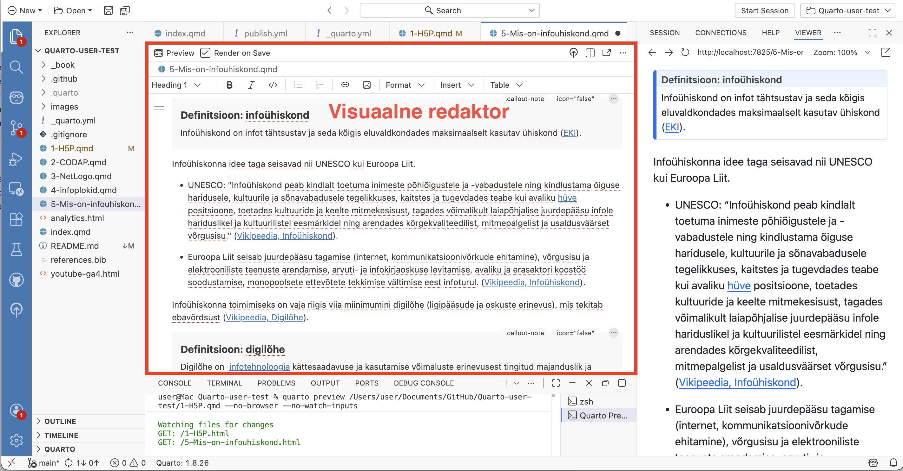

### Faili vaatamine Source Mode redaktoriga

Kui sa soovid faili vaadata **Source mode** redaktoris:

1.  Ava soovitud `.qmd` fail (nt `intro.qmd`).

2.  Vajuta üleval paremal kolme punktiga ikoonile ja vali **Edit in Source Mode.** Kui soovid vahetada vaate tagasi **Visuaalse redaktori** peale, siis tee sama, aga vali **Edit in Visual Mode.**

    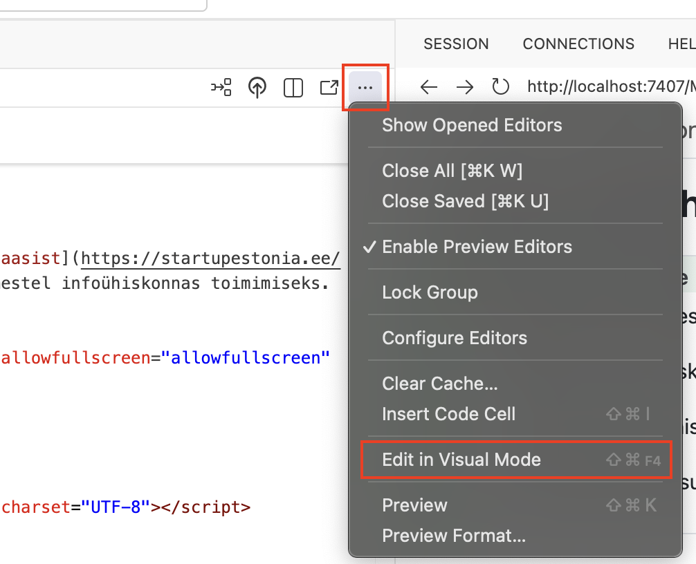{width="500"}

### Peatüki sisu muutmine

1.  Ava soovitud `.qmd` fail (nt `intro.qmd`)

2.  Muuda sisu vastavalt soovile. Testimise jaoks võid kirjutada näiteks mõne uue lause või lõigu.

3.  Üleval vasakul on valik **Render on Save**, veendu, et see on valitud. See tähendab, et Quarto üritab tuvastada automaatselt, kui sa salvestad faili ja uuendab eelvaadet.

    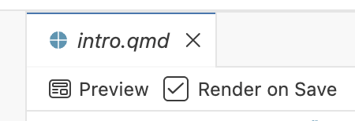

4.  Salvesta fail (`Ctrl+S` / `Cmd+S`).

5.  Vajuta nuppu **Preview**. See loob eelvaate õpiku veebiväljundist.

    ::: callout-tip
    ## Eelvaade ei pruugi alati automaatselt uueneda.

    Kuigi Quarto üritab jälgida kui oled failis teinud muudatusi ja selle salvestanud, võib juhtuda, et ta ei märka seda. Sellisel juhul vajuta uuesti **Preview** nuppu või `Shift+Cmd+K`\`/ `Ctrl+Shift+K`
    :::

    ::: callout-warning
    ## Windowsi kasutajatele

    Testimise käigus olen märganud, et Windowsi arvutites ei pruugi Quarto eelvade näha failide muudatusi. Seega kui oled näiteks lisanud ühe lõigu ja soovid näha kuidas see veebilehel välja näeb, vajuta alt prügikasti ikooni ja seejärel uuesti **Preview** nuppu või `Shift+Cmd+K`/ `Ctrl+Shift+K`
    :::

    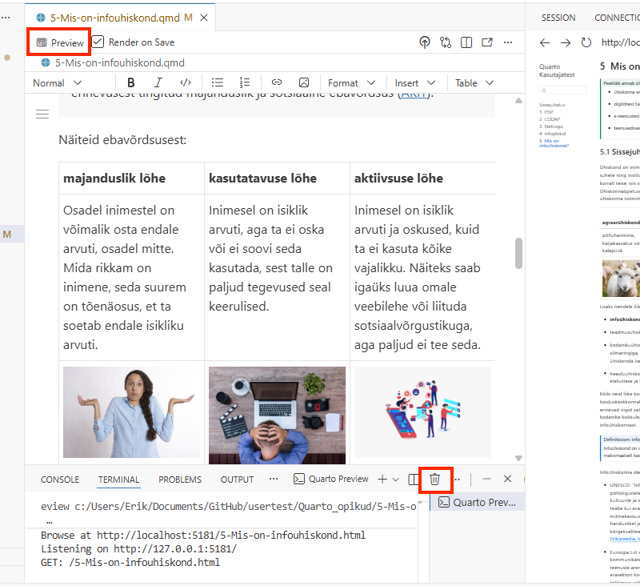{width="500"}

    ::: callout-note
    ## Eelvaadet saab avada ka brauseris

    Kui soovid, saad avada eelvaate ka oma brauseris. Selleks vajuta eelvaate paneeli üleval paremal **Open in browser** nuppu. Soovitan seda proovida siis kui tunned ennast kindlamalt Quarto raamatutega tööd tehes
    :::

    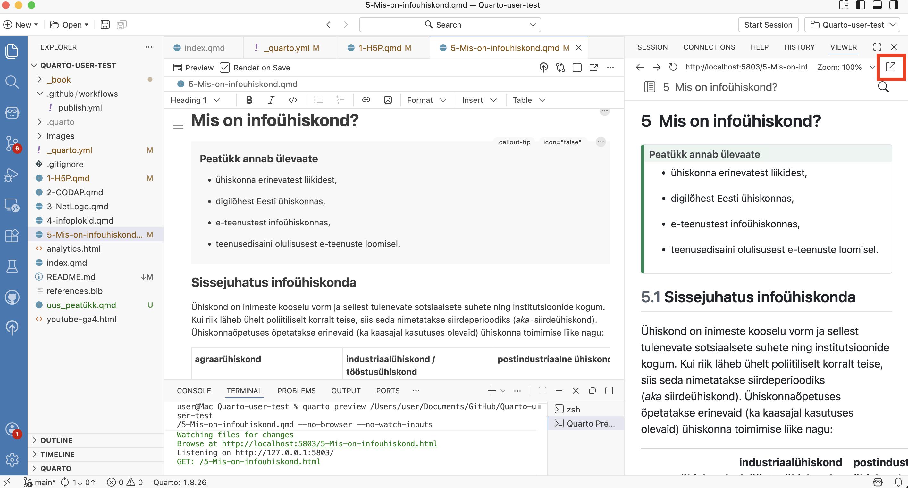

## Uue peatüki lisamine

Kuna iga `.qmd` fail on omaette peatükk, tuleb uue peatüki lisamiseks luua uus `.qmd` fail.

1.  Loo uus `.qmd` fail (nt `6-uus-peatykk.qmd`) explorer paneelis, klõpsates vasakul üleval nuppu **New File.** Nupp võib olla ruumi säästmiseks peidus, aga ilmub nähtavale kursuriga raamatu kausta nime peal hõljudes.

    ::: callout-important
    ## Ära unusta faili nime taha kirjutada faili laiendit `.qmd`
    :::

    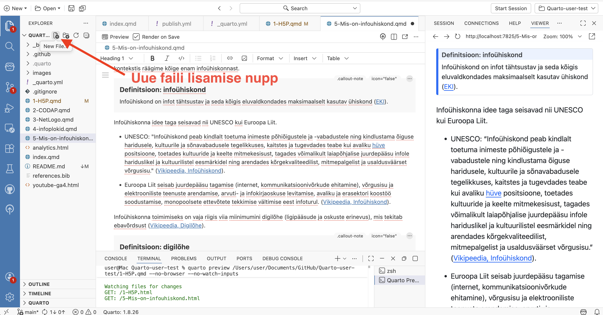

2.  Järgmiseks on vaja määrata kus kohas raamatus su uus peatükk asub. Ava `_quarto.yml` fail ja lisa uue peatüki failinimi `chapters` sektsiooni:

    ``` yaml
      chapters:
        - index.qmd
        - 1-H5P.qmd
        - 2-CODAP.qmd
        - 3-NetLogo.qmd
        - 4-infoplokid.qmd
        - 5-Mis-on-infouhiskond.qmd
        - 6-uus-peatykk.qmd      # Lisa näiteks siia, et loodud peatükk oleks viimane
    ```

3.  Salvesta fail (`Ctrl+S` / `Cmd+S`).

4.  Vali uuesti `6-uus-peatykk.qmd` fail **visuaalses redaktoris** ning lisa peatükile pealkiri. Kirjuta näiteks "Uus peatükk" ja seejärel muuda teksti stiil ülevalt paremalt **Heading 1-ks**.

    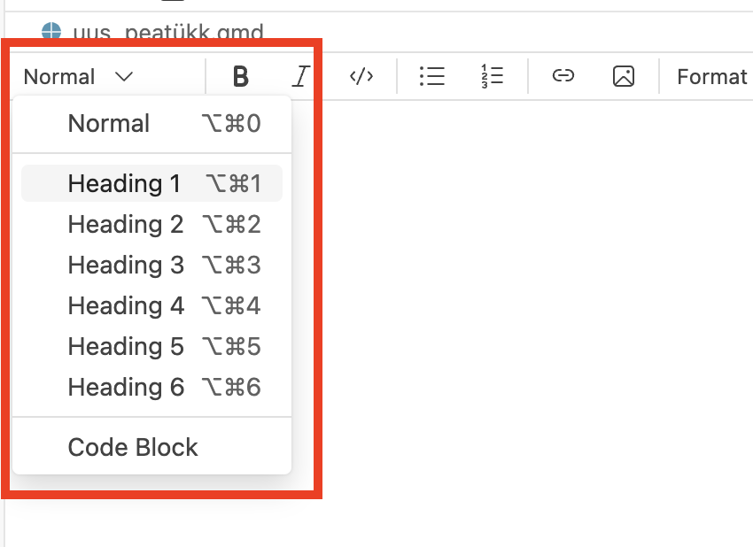{width="500"}

5.  Salvesta fail (Ctrl+S / Cmd+S) ja kontrolli tulemust eelvaates.

## Muudatuste avaldamine

Nüüd oleme teinud raamatusse üsna mitu muudatust ja oleks aeg see ka teistele nähtavaks teha. Selleks kasutame esimeses peatükis paigaldatud **GitHub Desktop** rakendust.

Me salvestame need tehtud muudatused n-ö "pakiks". Saadame need GitHubi, kus ka teised näevad neid ja seal luuakse automaatselt ka õpiku veebiversioon. Edaspidi käib veebiversiooni uuendamine sama moodi:

1.  Esmal veendu Positronis, et failid oleksid salvestatud (`Ctrl+S` / `Cmd+S`). Kui faili akna pealkirjas on ringikujuline ikoon, tähendab see, et antud failis on salvestamata muudatusi.

    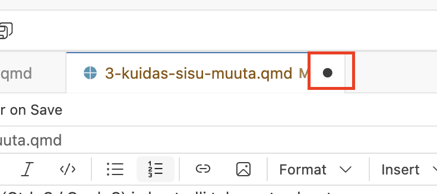

2.  Ava **GitHub Desktop**

3.  Vasakul näed muudetud faile, paremal pool valitud failis tehtud muudatusi.

    ::: callout-note
    ## GitHub Desktop võib näidata rohkem failimuudatusi kui sa tegid

    Kuna Quarto genereerib sinu muudetud `.qmd` failidest ka veebilehe jms, siis võid näha GitHub desktopis sinu muudetud ühe faili asemele muudatusi näiteks kolmes failis.
    :::

4.  Kirjuta alla väljale **"Summary"** lühike kirjeldus (nt "Lisasin uue peatüki").

5.  **Description** väljale võid lisada pikema kirjelduse, kui soovid (nt "Uus peatükk annab ülevaate...").

6.  Klõpsa **"Commit to main"** - see salvestab muudatused sinu arvutis "pakiks".

    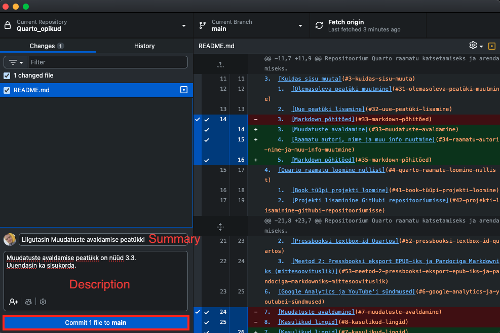

7.  Klõpsa üleval või paremalpool **"Push origin"** - see laeb "paki" üles GitHubi.

    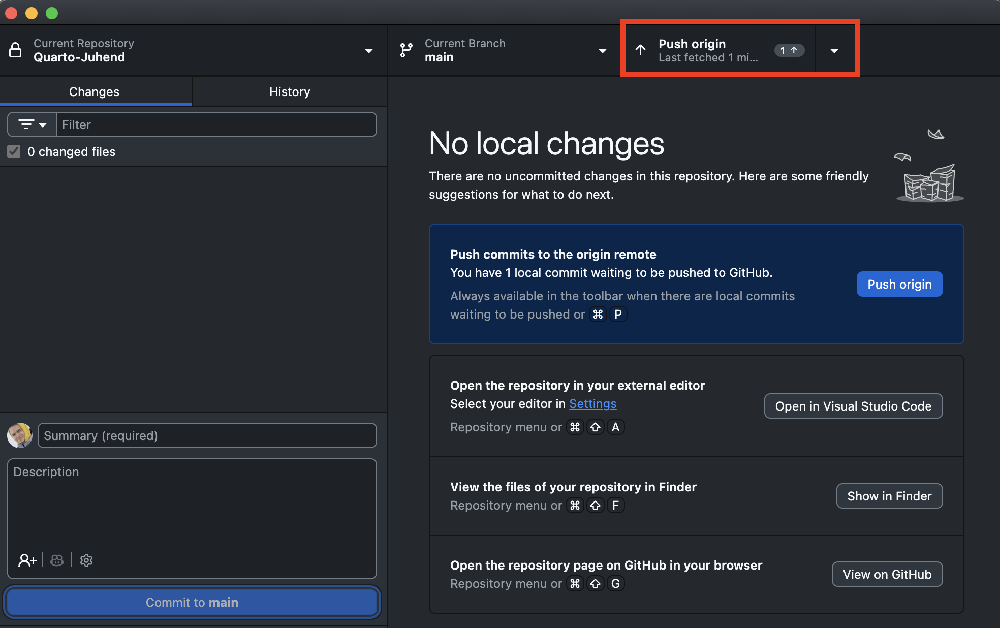

    > **Commit** = salvesta muudatused lokaalselt (sinu arvutis)\
    > **Push** = lae muudatused üles GitHubi (et teised näeksid)

    GitHub Actions ehitab ja avaldab raamatu automaatselt. Paari minuti pärast on muudatused nähtavad ka raamtu veebilehel.

8.  Et saada **link** oma raamatu veebilehele ja teha see ka teiste jaoks lihtsasti kättesaadavaks, mine veebibrauseris tagasi oma loodud repositooriumi lehele. Selleks vajuta nuppu **View on GitHub**.

    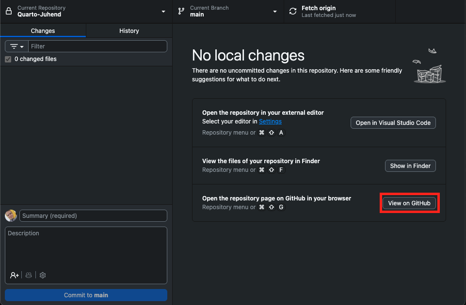{width="500"}

9.  Seejärel vajuta **About** sektsioonis hammasratta ikoonile.

    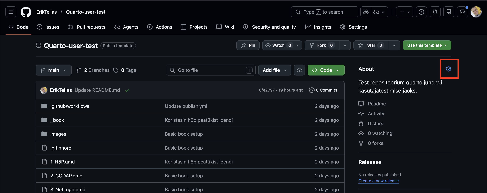{width="500"}

10. Vali avanenud aknas Use your **GitHub Pages website** ja seejärel **Save changes.**

    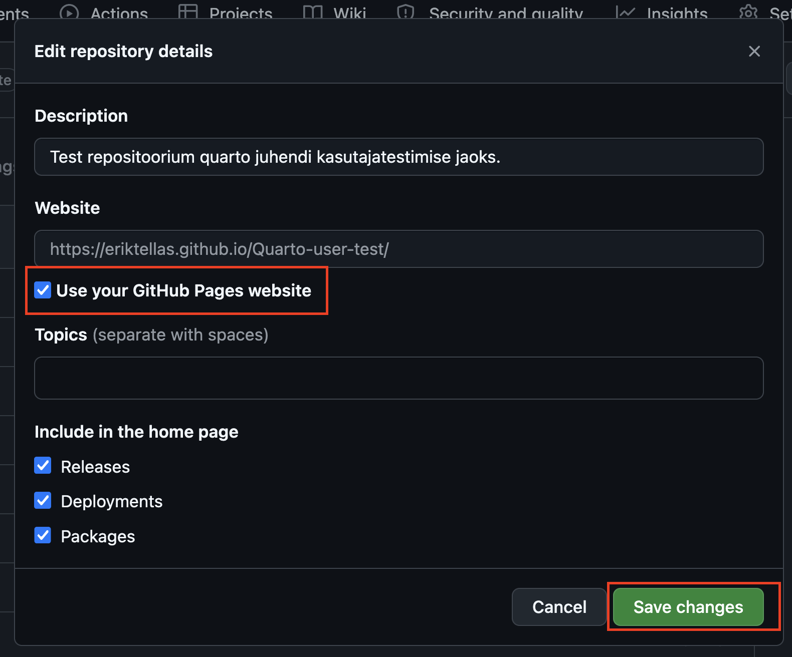{width="500"}

11. Nüüd ilmub sinu raamatu link **About** sektsiooni. Sealt saad selle alati lihtsasti kätte.

    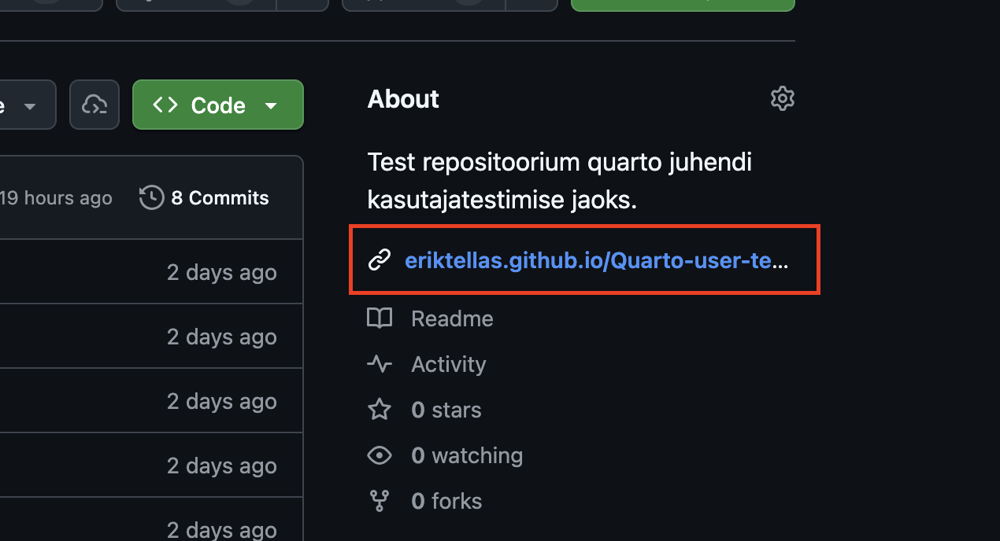{width="500"}

    ::: callout-note
    ## Lingi formaat

    GitHub Pages veebilehtede formaat on tavaliselt järgmine:\
    [https://SINU-KASUTAJANIMI.github.io/REPOSITOORIUMI-NIMI/](https://sinu-kasutajanimi.github.io/Quarto_opikud/)

    Ehk siis antud juhul on link:\
    [https://SINU-KASUTAJANIMI.github.io/Quarto_opikud/](https://sinu-kasutajanimi.github.io/Quarto_opikud/)
    :::

------------------------------------------------------------------------

## Raamatu autori, nime ja muu info muutmine

1.  Ava `_quarto.yml` fail

2.  Muuda `title`, `author` ja muid välju vastavalt soovile

    ``` yaml
    book:
        title: "Minu Quarto Raamat"
        author: "Teie Nimi"
        date: "4/17/2026" # Raamatu avaldamise kuupäev
    ```

    Lisainfo: <https://quarto.org/docs/guide/>

## Markdown põhitõed

``` markdown
# Pealkiri 1
# Pealkiri 2
## Pealkiri 3

**Paks tekst**
*Kaldkiri*

- Loetelu punkt
- Teine punkt

1. Nummerdatud
2. Loetelu

[Link](https://example.com)


```

Vaata ka - [Markdown juhend](https://www.markdownguide.org/basic-syntax/)

------------------------------------------------------------------------