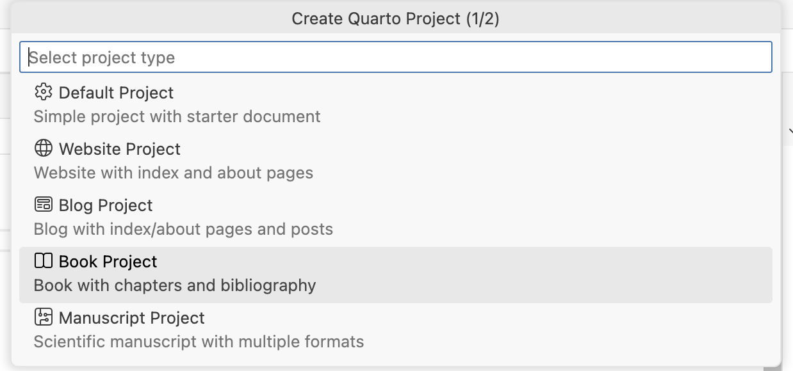
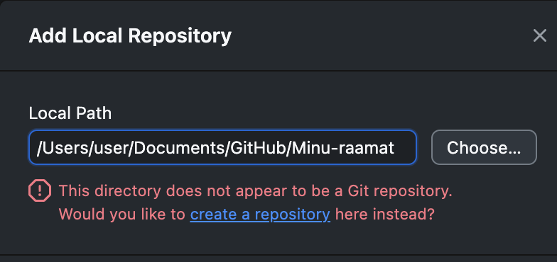
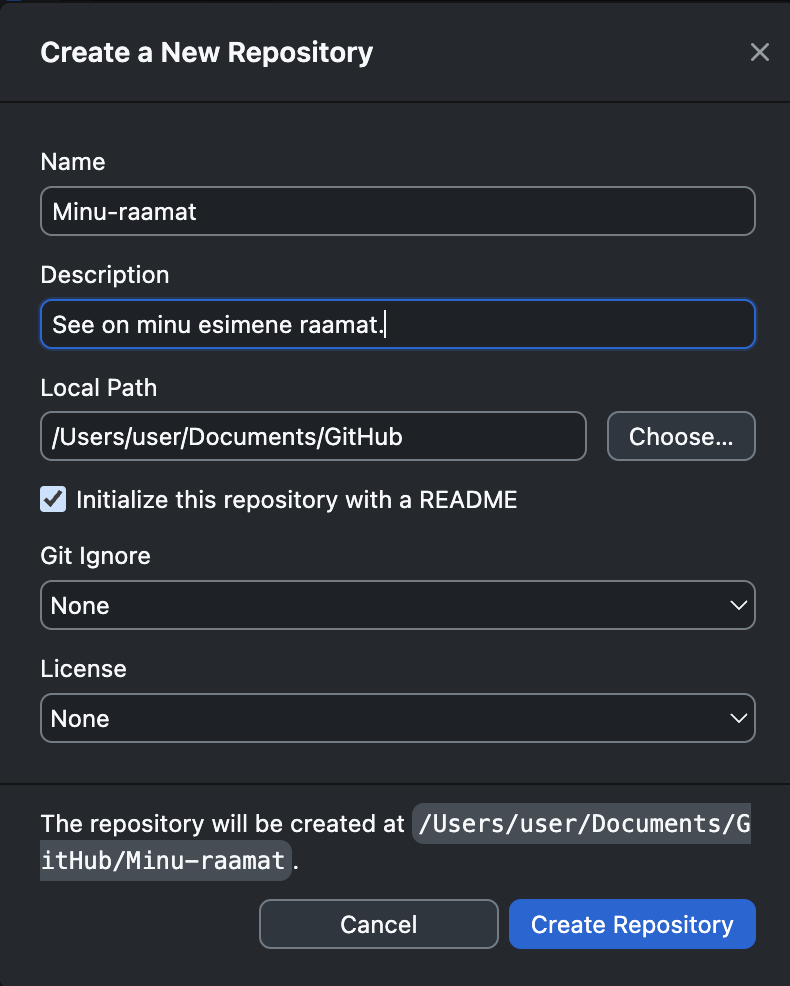
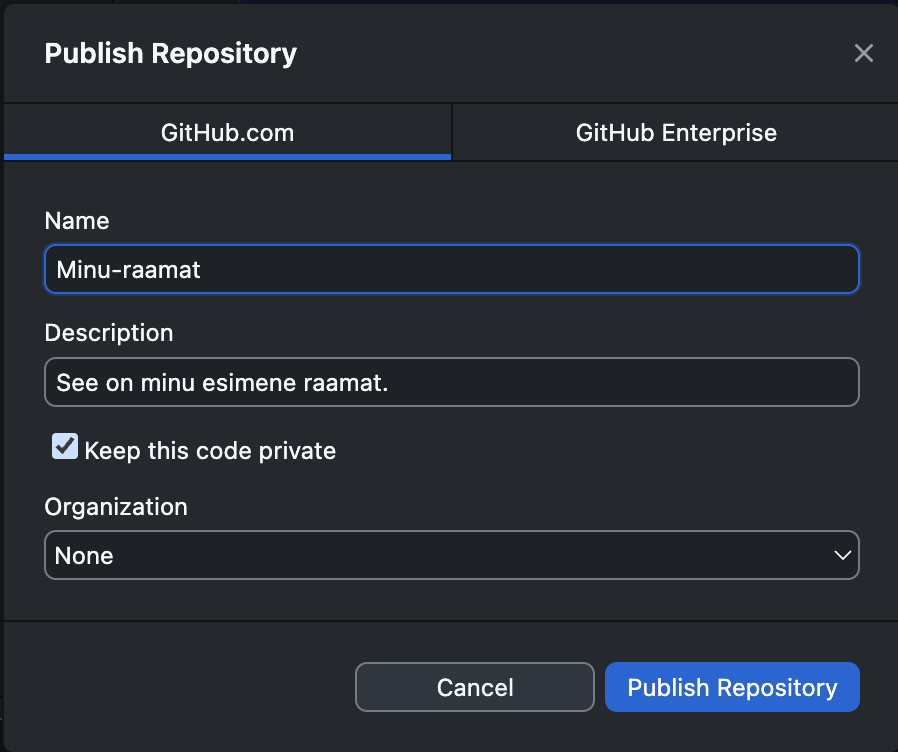
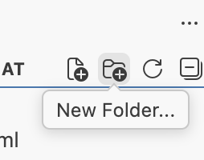
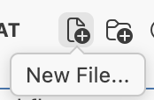
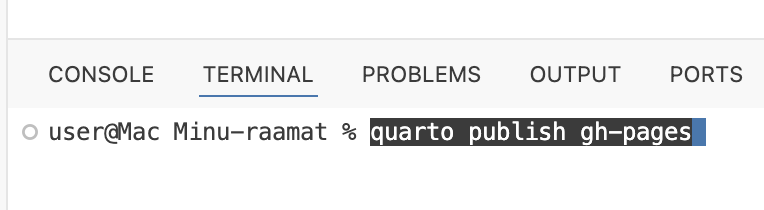

# Quarto raamatu loomine nullist

Selles peatükis on juhised, kuidas luua uus Quarto raamat nullist, lisada see GitHubi repositooriumisse ja avaldada see veebilehena GitHub Pagesi kaudu.

## Book tüüpi projekti loomine

1.  Ava `Command Palette` (Positroni käsuriba):

-   Cmd + Shift + P (Mac)
-   Ctrl + Shift + P (Windows)

2.  Otsi "Quarto: Create New Project" ja vali see

3.  Vali "Book" tüüpi projekt

    

4.  Seejärel vali projekti asukoht (soovituslikult: `Documents/GitHub/`)

5.  Seejärelt anna projektile nimi (nt "Minu-Raamat") ja vajuta **Enter**

## Projekti lisaminine GitHubi repositooriumisse

1.  Ava **GitHub Desktop**

2.  Klõpsa **File → Add Local Repository**

3.  Vali projekti kaust (nt `Documents/GitHub/Minu-Raamat`) vajutades nupul **Choose** ja klõpsa **Add Repository**

4.  GitHub hoiatab, et see kaust ei ole veel Git repositoorium, klõpsa **create a repository**

    

5.  Avanevas aknas võid lisada lühikese kirjelduse (nt "Minu esimene Quarto raamat") ja valida ka **Initialize this repository with a README**. `Readme` fail on hea tava, kuna see annab teistele kasutajatele ülevaate, mis see projekt on ja kuidas seda kasutada. Nt see õpetus siin on `Readme`fail.

    

6.  Seejärel klõpsa **Create Repository**

7.  Nüüd saad ülevalt valida **Publish repository**. Jälgi, et **Keep this code private** oleks valitud. Hiljem saad teha oma repositooriumi soovikorral avalikus või seda valitud isikutega jagada. Seejärel klõpsa **Publish Repository**, mis laeb projekti GitHubi.

    

8.  Seejärel saad näha oma projekti GitHibis vajutades nupule **View on GitHub**. 

## Avaldamine GitHub Pagesi

1.  Loo uus kaust nimega `.github` projekti juurkausta (`Documents/GitHub/Minu-Raamat/.github`)

2.  Selles `.github` kaustas loo uus kaust nimega `workflows` (`Documents/GitHub/Minu-Raamat/.github/workflows`)

    

3.  Selles `workflows` kaustas loo fail nimega `publish.yml` (`Documents/GitHub/Minu-Raamat/.github/workflows/publish.yml`)

    

4.  Ava `publish.yml` fail ja kopeeri sinna järgmine sisu:

``` yaml
on:
  push:
    branches: 
      - main
  workflow_dispatch:

name: Quarto Publish

jobs:
  build-deploy:
    runs-on: ubuntu-latest
    permissions:
      contents: write
    steps:
      - name: Check out repository
        uses: actions/checkout@v4

      - name: Set up Quarto
        uses: quarto-dev/quarto-actions/setup@v2

      - name: Render and Publish
        uses: quarto-dev/quarto-actions/publish@v2
        with:
          target: gh-pages
          path: .
        env:
          GITHUB_TOKEN: ${{ secrets.GITHUB_TOKEN }}
```

5.  Salvesta fail (`Ctrl+S` / `Cmd+S`)

6.  Vali alt poolt **Terminal** ja kopeeri sinna käst `quarto publish gh-pages`ja vajuta `Enter`. Terminal küsib, kas soovid avaldada raamatu antud aadressil, vajuta `Y` ja siis `Enter`. See käsk ehitab raamatu ja avaldab selle GitHub Pagesi kaudu. Käsk loob ka uue haru `gh-pages`, kus ei ole `.qmd`faile jms. Paari minuti pärast on raamat kättesaadav aadressil: <https://sinu-kasutajanimi.github.io/raamatu-nimi/>

    

7.  Tee commit ning push GitHubi (vt peatükk "3.3. Muudatuste avaldamine")

Nüüd on sinu raamat avaldatud ja iga kord, kui teed muudatusi ja pushid need `main`harusse, ehitab GitHub Actions raamatu uuesti `gh-pages` harusse ja avaldab uuendatud versiooni veebis.

------------------------------------------------------------------------