# Sisu kolimine Pressbooksist

## Meetod 1: Kopeerimine redaktorist redaktorisse (soovituslik)

See on kõige lihtsam viis sisu üle tuua. Enamus sisust saab kopeerida lihtsalt ühest redaktorist teise.

> **Mis säilib:** pealkirjad, lihttekst, rasvane/kaldkiri, pildid, loendid, lingid, tabelid.
>
> **Mida tuleb käsitsi lisada:** sisseehitatud videod (YouTube iframe'id), H5P elemendid, koodiplokid, text box-id ja muud interaktiivsed komponendid, kuna need ei kopeeru alati õigesti läbi visuaalse redaktori.

**Sammud:**

1.  Ava Pressbooks ja navigeeri peatükki, mida soovid üle tuua
2.  Vali kogu tekst (`Ctrl+A` / `Cmd+A`) või ainult soovitud osa ja kopeeri (`Ctrl+C` / `Cmd+C`)
3.  Ava Positronis vastav `.qmd` fail (või loo uus, vt jaotist "3.2 Uue peatüki lisamine")
4.  Veendu, et Positroni redaktor on **Visual Mode** vaates
5.  Klõpsa `.qmd` faili sisus kuhu soovid sisu lisada ja kleebi (`Ctrl+V` / `Cmd+V`)
6.  Salvesta fail (`Ctrl+S` / `Cmd+S`)

::: callout-important
## Tähtis!

Quarto võtab esimese "Heading" teksti ja otsustab selle järgi, mis on peatüki pealkiri. Lisaks tõstetakse see lehe ülaossa.

Seega tasub peatüki pealkiri liigutada ise lehe algusesse, et vältida probleeme.

Kuna sisukord luuakse automaatselt, tuleb alapealkirjad märkida Heading 2-ks, 3-ks jne, vastasel juhul ei toimi sisukord korrektselt.
:::

## Pressbooksi textbox-id Quartos

Pressbooksi textbox-id ei tule kopeerimisel kaasa koos õige kujundusega. Lahendus on need Quartos uuesti luua.

**Sammud:**

1.  Paiguta kursor kohta kuhu soovid luua `Callouti`
2.  Vali ülevalt tööriista ribalt `Insert` ja siis `Callout`
3.  Vali `Type` vastavalt soovitud kasti värvile (vt alt poolt)
4.  Sisesta `Caption` väljale kasti pealkiri (Nt Peatükk annab ülevaate)
5.  Eemalda linnuke `Display icon alongside callout`
6.  vajuta 'OK'
7.  Nüüd saad kirjutada kasti sisse soovitud sisu
8.  Kui oled korra `Callout` kasti valmis loonud saad seda edaspidi soovikorral ka kopeerida

**Type määrab callouti värvi:**

-   Tip = roheline
-   Note = sinine
-   Warning = kollane
-   Caution = oranš
-   Important = punane

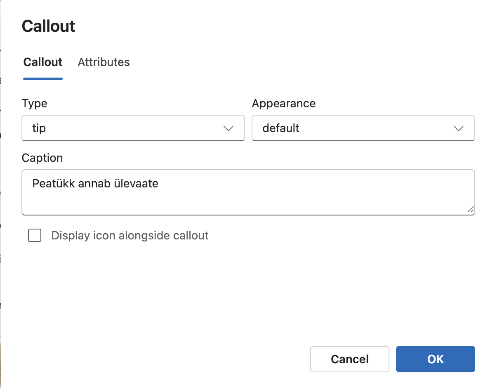

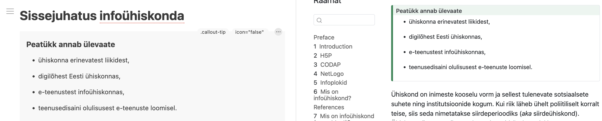

## iFrame elementide lisamine(H5P, YouTube videod jms)

### H5P elemendi lisamine

1.  Vajuta soovitud elemendi peal nuppu **\<\>Manus**

    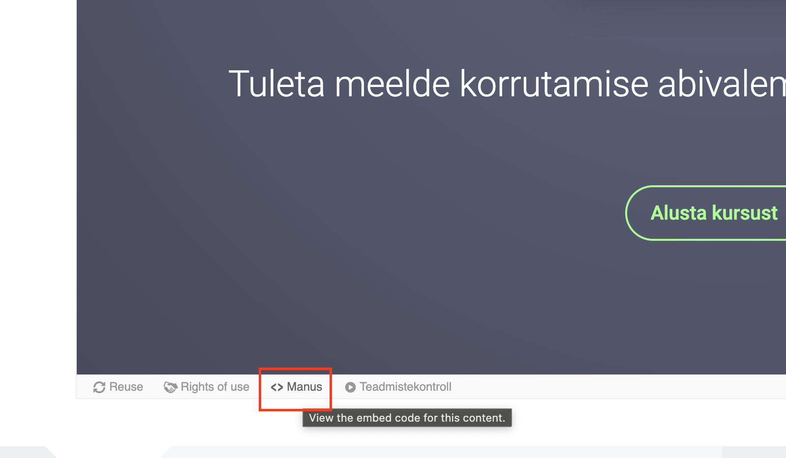{width="500"}

2.  Kopeeri terve `iFrame` element

    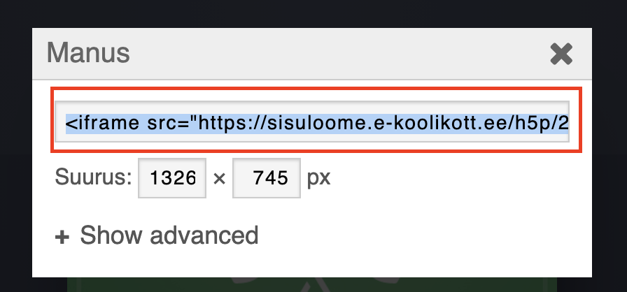{width="500"}

3.  Kleebi element viusaalses redaktoris soovitud kohta

    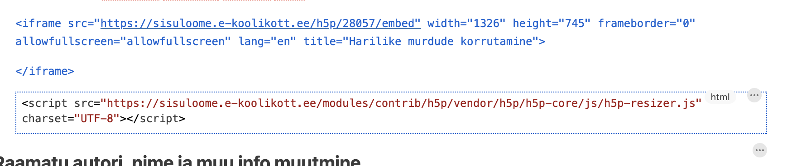{width="500"}

    Peale faili salvestamist ja eelvaate värskendamist ilmub H5P element raamatus nähtavale

    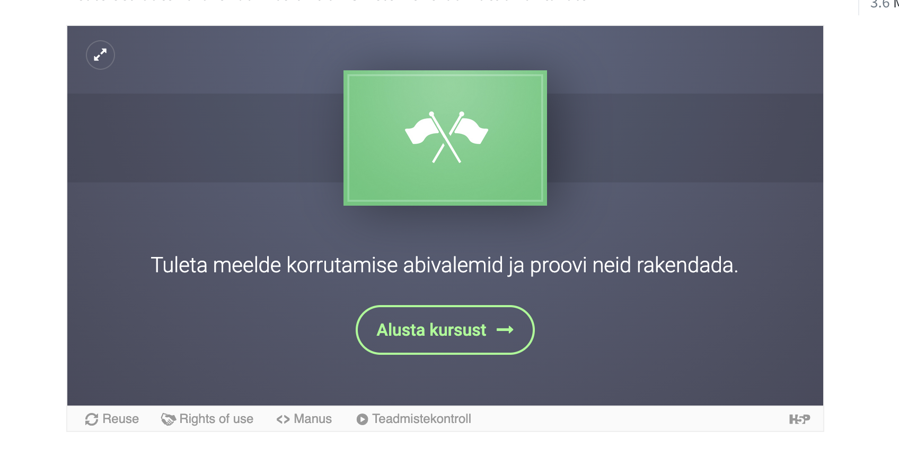{width="500"}

### YouTube videote lisamine

1.  Vajuta soovitud YouTube video alla jagamise nuppu

    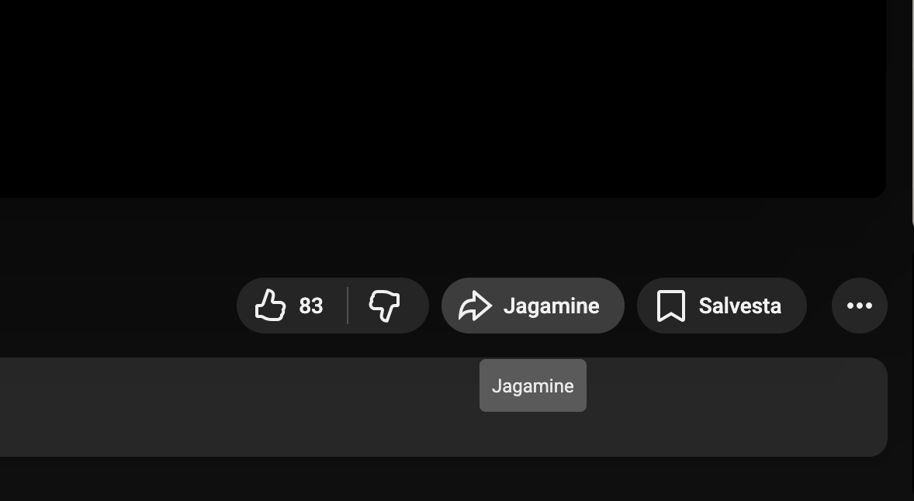{width="500"}

2.  Seejärel vali manusta

    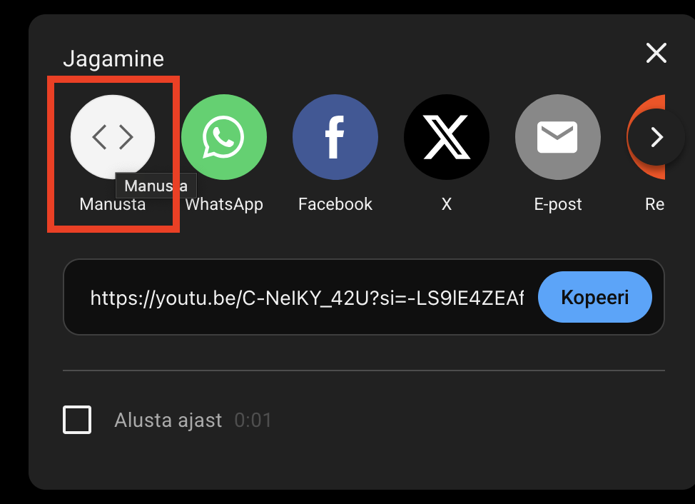{width="500"}

3.  Vajuta akna alt paremalt kopeeri

    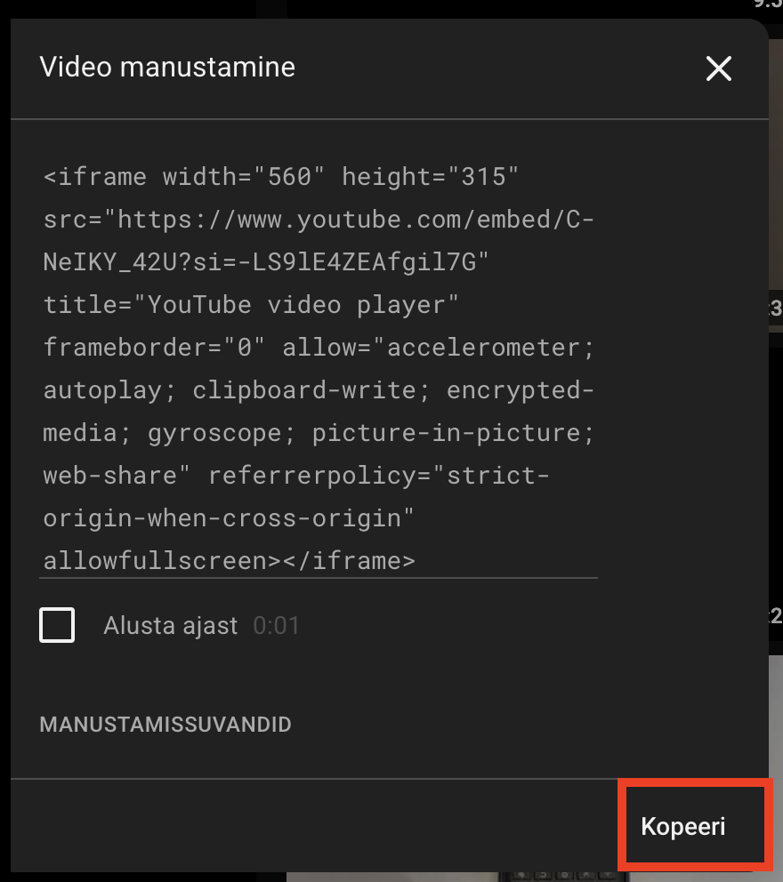{width="500"}

4.  Kopeeritud `iFrame` elementi kleebi visuaalses redaktoris soovitud kohta

    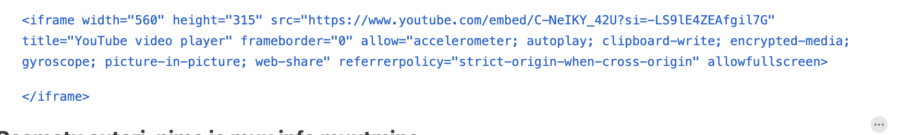{width="500"}

    Peale faili salvestamist ja eelvaate värskendamist ilmub YouTube element raamatus nähtavale

    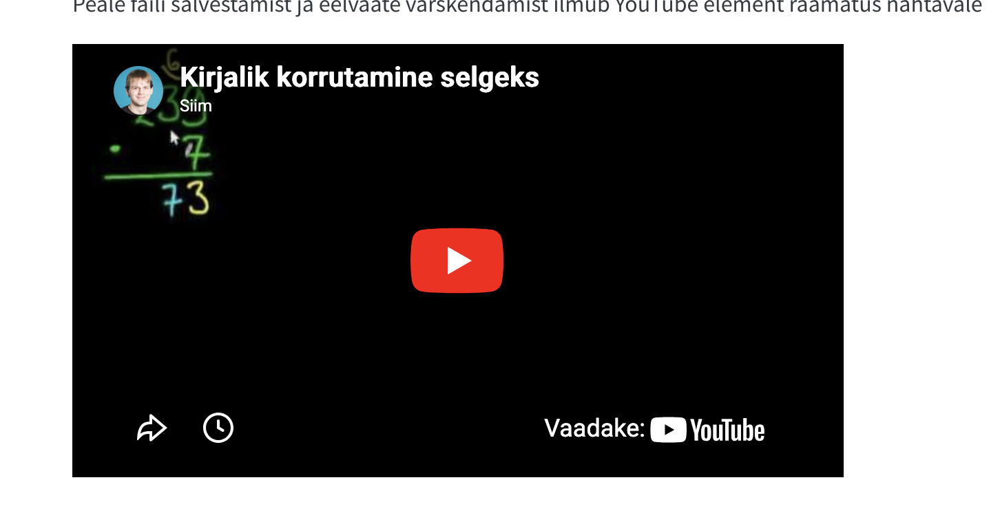{width="500"}

## Meetod 2: Pressbooksi eksport EPUB-iks ja Pandociga Markdowniks (mittesoovituslik)

See meetod on olemas, kuid tulemus ei ole tavaliselt parem kui lihtsalt sisu redaktorist ümber kopeerimine.

**Miinused:**

-   Pandocist tulev Markdown vajab tavaliselt palju käsitsi puhastamist
-   Pildid tuleb eraldi õigesse kohta kopeerida
-   Pildid ei tööta Positroni Visual mode vaates

**Sammud:**

1.  Ekspordi Pressbooksist raamat EPUB failina
2.  Käivita terminalis pandoc käsk (vajadusel installi enne Pandoc):

``` bash
pandoc eksporditud-raamat.epub -t markdown_strict --extract-media=. -o markdownis-raamat.md
```

3.  Tulemuseks saad ühe Markdown faili ja eraldi meediafailid- Pandoc paneb pildid `assets` kausta
4.  See `assets` kaust tuleb tõsta `_book` kausta, et pildid veebiväljundis töötaksid
5.  Seejärel tuleb Markdown sisu üle kontrollida ja vajadusel Quartole sobivaks kohandada

------------------------------------------------------------------------